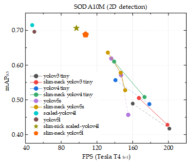

# 基于于GSConv的轻量融合层：一个更好的轻量化检测器结构设计范式用于自动驾驶
[论文](https://arxiv.org/ftp/arxiv/papers/2206/2206.02424.pdf)

  

 实验数据集:
    - PASCAL VOC 2007+12 (通用检测器)
    - WiderPerson (用于行人检测)
    - SODA10M (用于自动驾驶)
    - DOTA1.0 (用于遥感影像目标检测)

   (我们只提供我们所使用的训练、验证和测试的文本文档,以便于您复现我们的结果。 被标注的图像和它们的标注文件请您访问相应的数据集官方网站获取。) 
---
### 遥感小目标检测结果的一个对比例子
scaled-yolov4

  

slim neck scaled-yolov4

  

---

## 训练自定义数据集
### 训练基于GSConv的轻量化yolov5检测器

    git clone https://github.com/Sueyuki/gsconv-yolov5.git
    cd slim-neck-by-gsconv/gsconv-yolov5
    pip install -r requirements.txt
将数据集文件放入项目文件夹内，并根据需要修改执行下面命令

    python train.py --data yolodata/waterfacedata.yaml --cfg models/GSConv-yolov5s.yaml --weights yolov5s.pt --batch-size 3 --img 640 --epochs 300

## 验证和测试基于GSConv的轻量检测器的性能
### 测试基于GSConv的轻量化yolov5检测器
    cd gsconv-yolov5
    python val.py --data yourdata.yaml --weights sm-yolov5s.pt --task test

  - https://github.com/ultralytics/yolov5
  - https://github.com/huawei-noah/CV-backbones/tree/master/ghostnet_pytorch
  - https://github.com/d-li14/mobilenetv3.pytorch
  - https://github.com/megvii-model/ShuffleNet-Series

## 引用此工作
@article{li2022slim, 
  title={Slim-neck by GSConv: A better design paradigm of detector architectures for autonomous vehicles}, 
  author={Li, Hulin and Li, Jun and Wei, Hanbing and Liu, Zheng and Zhan, Zhenfei and Ren, Qiliang}, 
  journal={arXiv preprint arXiv:2206.02424}, 
  year={2022} 
}
